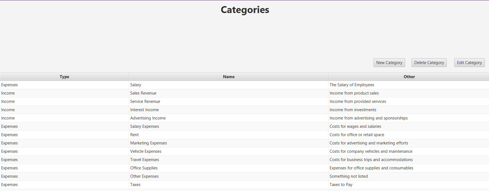

## DOKUMENTATION

## Homepage

## Balkendiagramm nach Jahr anzeigen

## Balkendiagramm mit ungezahlten Rechnungen anzeigen ( Siehe links unten in der Abbildung )

## Nach Datum Filtern

## Nach Datum Filtern - Invoices Tabelle -> Beim Filtern in der Homepage wird die Invoices Tabelle wie folgt mitgefiltert

## Nach Betrag Filtern

## Alle Rechnungen - Rechnungs "Tab"

## Rechnungen Suchfunktion ( Aktualisiert nach jeder veränderung im Textfeld )

## Neue Rechnung anlegen

## Alle Kunden anzeigen

## Neuen Kunden anlegen

## Alle Kategorien

## Neue Kategorie anlegen

## Datenbank Struktur

